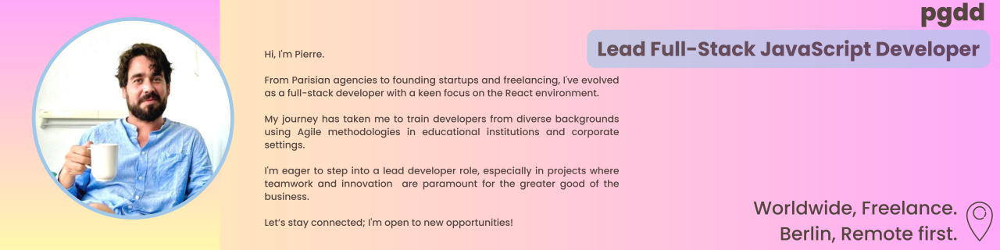

---

### 📌 About Me
Hi, I'm Pierre. 🚀 From Parisian agencies 🗼 to founding startups 🌆, I've grown as a full-stack developer. This evolution took me to train devs from varied backgrounds in Brussels and Berlin, and even in corporate environments like the dynamic Dashlane Q/A Team! With vast experience and proficiency in JavaScript & React.js, I'm eager to re-engage as a lead senior developer, always focusing on projects where teamwork 🤝 and innovation 💡 take the front seat.

---

### 🎯 Work Preferences
- 🚀 **Contract**: Full-time, Part-time  
- 📅 **Earliest start date**: Immediately  
- 🌐 **Languages**: English (Fluent), French (Fluent), Italian (Conversational)  
- 💼 **Desired Roles**: Frontend Engineer (9+ years), Fullstack Engineer (10+ years), Tech Lead (5 years), Backend Engineer (9+ years)

---

### 💡 Tech Expertise:

 HTML  
 CSS  
 JavaScript  
 TypeScript  
 React  
 Next.js  
 Node.js  
 Express.js  
 Redux  
 MongoDB  
 Sequelize  
 AWS  
 Jest  

---

### 🌟 Highlights:x

#### 🎙️ About:
Starting from Parisian agencies 🗼 and moving through the challenges of founding startups 🌆, I've matured into a seasoned full-stack developer and dedicated JavaScript trainer. Now looking to contribute as a lead senior developer, I am drawn to environments where teamwork 🤝 and innovation are paramount for the success of projects and businesses.

#### 📍 Work Preference:
🇩🇪 Location: Berlin (Preferred for Full-time), Europe (Open to Remote or Partially Remote roles)
🌍 Engagement: Freelance (Available for Full-time or Short-term projects), Employment Contract

---

### 🛠️ Experience:

- **Lead Developer**, Capote-Eyewear  
  August 2022 - August 2023  
  Technologies: Tailwind, Vercel, CI/CD, Github, Shopify, CMS, Next.js, REST API

- **JS Instructor for QA**, Dashlane  
  March 2022 - July 2023  
  Technologies: Javascript, Node.js, BDD, TDD, Mocha, Chai, Cypress

- **JS Instructor Berlin**, Wild Code School  
  September 2019 - September 2021  
  Technologies: Javascript, HTML, CSS, React, Node.js, REST API, MongoDB, MySQL, Express.js

- **CEO & CTO**, Bakers  
  January 2017 - December 2019  
  Technologies: React Native, REST API, AWS, MongoDB, Redux, Sass, Express.js

- **Full Stack Developer**, Anagram  
  January 2016 - January 2017  
  Technologies: Cordova, React, PHP, WordPress, Backbone.js, Framework7, REST API, Marionette.js, Sequelize, Scrum, Express.js

- **Full Stack Developer**, Clint Agency  
  September 2015 - January 2017  
  Technologies: PHP, Slim Framework, Laravel, Sequelize, SOAP API, Javascript, Scrum, React, Express.js, Unit Testing

- **Full Stack Developer**, Freelance  
  January 2014 - December 2015  
  Technologies: Ruby, RubyOnRails, Javascript, Meteor JS, AWS, Bootstrap

- **Product Owner**, Speedyweb  
  January 2007 - November 2011

---

### 📚 Education:

- **General Assembly – Hong Kong**  
  Full Stack Development  
  2014

- **General Assembly – New York**  
  Essentials of Startup Law: Formation, Fundraising, Exits  
  2013

- **Sorbonne Law School – Paris**  
  Private Law  
  2008 - 2010

- **Hypokhâgnes – Nice**  
  Literature, Philosophy, Political Science  
  2006 - 2007

---

### 💭 Interesting Fact:
One fun fact outside of work? I'm deeply 📖 fascinated by literature, psychology, and philosophy. I've had a few personal rendezvous with the mystical – some might even say I have a hint of a psychic touch. But don't worry, I promise to only use my powers for good... and maybe to predict the next big JavaScript framework! 🔮

---

### 🌐 Open Source Contributions:
I'm highly open to participating in open-source projects. 🤝 Collaborative coding is one of the aspects I cherish, and giving back to the community is something I'm passionate about. How can I help?

---

### 📞 Contact:
- 📍 **Location**: Paris, Nice, Berlin, Hamburg, Europe & France
- ☎️ **Phone**: +33 6 16 26 44 03
- 💼 [LinkedIn](https://www.linkedin.com/in/pierregiddio/)

---

*Privacy note: All data shared here is for professional contacts. Kindly refrain from using it for unsolicited communications.*

---

© 2023 Pierre Giddio
